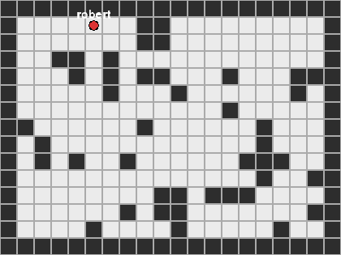

# SABLE -- Up to Date as of 07/27/2027

**A simulation of robot swarms that explore unknown areas together when their
radios are unreliable** — messages drop, arrive late, or go stale, and robots must
keep exploring effectively anyway.



*A single robot (classical A\* frontier-search baseline) explores an unknown map;
the trail shows its path.*

**Stack:** Python · PyTorch · NumPy · Gymnasium · PettingZoo · Pygame — *(planned: MAPPO, Go, Gazebo)*

---

**SABLE** (*Swarm Autonomy under Bandwidth-Limited Exploration*) studies
resource-aware, decentralized multi-robot exploration of unknown, GPS-denied
environments. Each robot acts without a central controller and under limited,
delayed, lossy, or intermittent communication. The system must stay useful when
messages go stale, localization is uncertain, bandwidth is scarce, and teammates fail.

The central question:

> Can a tiny decentralized policy jointly manage exploration, message timing,
> message content, and message trust while preserving mission performance under
> hard compute, memory, energy, and bandwidth limits?

SABLE keeps safety-critical, easily-specified functions classical (occupancy
mapping, frontier extraction, path planning, collision avoidance) and applies ML
only where coordination becomes combinatorial or brittle.

## Quickstart

```bash
python -m venv .venv && source .venv/bin/activate
pip install -r requirements.txt
python src/main.py          # watch a robot explore under a classical policy
```

## Current state (May not be up to date as project progresses)

A lightweight Python simulation: a grid-world map generator, robot and observation
models, classical exploration baselines (random, move-toward-unknown, frontier
search via BFS and A\*), a renderer to watch runs, and a metrics harness that
evaluates policies across default maps.

## Plan

**Learn communication policies with MAPPO.** Train multi-agent policies
(Multi-Agent PPO) for learned compact message content, event-triggered
transmission timing, and staleness-/uncertainty-aware reception, benchmarked
against the classical baselines.

## Future work

- **Realistic networking.** Simulate network communication through daemons written
  in Go, so message loss, latency, and bandwidth limits reflect real transport
  behavior rather than idealized assumptions.
- **Higher-fidelity simulation.** Port to Gazebo for physics-based, higher-fidelity
  simulation and a path toward physical deployment.

## Layout

- `src/` — environment, map, robot, observations, policies, renderer
- `docs/` — internal master design document, published later
- `results/` — baseline evaluation logs, published incrementally
